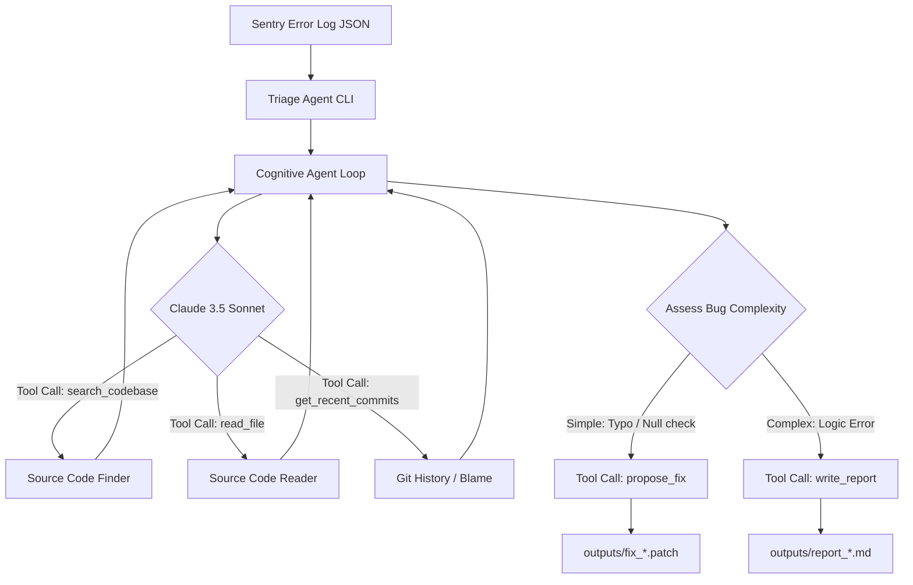

# DevOps Incident Triage Agent

An AI-powered automated incident triage and bug-fixing assistant designed to inspect application error logs (e.g., Sentry alerts), locate the root cause in the codebase, and either propose a safe bug fix (patch file) or write a detailed triage report for complex logic bugs.

## Problem Statement
When production systems crash or experience behavior anomalies, DevOps and engineering teams spend critical minutes (sometimes hours) digging through logs, searching codebases, and inspecting recent git commits to locate the bug. Many production issues are simple typos or missing null checks that can be safely automated. However, complex logic errors shouldn't be auto-fixed by AI without human review.

This agent automates the diagnostic phase, separating issues into:
1. **Auto-Fixable**: Typo, missing null check, syntax error. Outputs a ready-to-apply `.patch` file.
2. **Review-Required**: Complex logic anomalies, behavior discrepancies. Outputs a markdown triage report outlining hypotheses and suggestions, but makes no code changes.

---

## Architecture Diagram



---

## How to Run It

### Prerequisites
* Python 3.11+
* Git (optional, for git commits and blame tools)
* Anthropic API Key (optional; if missing, the agent runs in **Demo Mode**)

### Setup
1. Clone or copy the project files to your workspace.
2. Install the Anthropic SDK:
   ```bash
   pip install anthropic
   ```
3. Set your API Key (optional):
   * **Windows (PowerShell)**:
     ```powershell
     $env:ANTHROPIC_API_KEY="your-api-key-here"
     ```
   * **Linux/macOS**:
     ```bash
     export ANTHROPIC_API_KEY="your-api-key-here"
     ```

### Execution
Run the triage script by providing the path to a simulated Sentry error log:

```bash
# Run Triage for Bug 1 (NameError Typo)
python triage.py --error errors/error_1.json

# Run Triage for Bug 2 (AttributeError Null Check)
python triage.py --error errors/error_2.json

# Run Triage for Bug 3 (Logic Bug Registration Failure)
python triage.py --error errors/error_3.json
```

*Note: If no API key is detected, the CLI runs in a fully interactive simulated **Demo Mode** showing the agent's exact cognitive loop and generating the outputs.*

---

## Example Inputs & Outputs

### 1. Bug 1: NameError (Typo)
* **Input Log**: [`errors/error_1.json`](file:///C:/Users/home/.gemini/antigravity/scratch/devops_triage_agent/errors/error_1.json)
* **Agent Behavior**: Recognizes typo `updted_user` instead of `upd_user` in `buggy_app/services/users.py` and creates a patch.
* **Output File**: [`outputs/fix_users_py_8c0a8cf5c6354b9d99723be6ea684d0b.patch`](file:///C:/Users/home/.gemini/antigravity/scratch/devops_triage_agent/outputs/fix_users_py_8c0a8cf5c6354b9d99723be6ea684d0b.patch)
* **Diff Content**:
  ```diff
  diff --git a/buggy_app/services/users.py b/buggy_app/services/users.py
  index 6f3a8b2..2c91df0 100644
  --- a/buggy_app/services/users.py
  +++ b/buggy_app/services/users.py
  @@ -47,4 +47,4 @@ def update_user(user_id: int, update_data: UserUpdate) -> User | None:
           user.profile = update_data.profile
           
       upd_user = user
  -    return updted_user
  +    return upd_user
  ```

### 2. Bug 2: AttributeError (Null Check)
* **Input Log**: [`errors/error_2.json`](file:///C:/Users/home/.gemini/antigravity/scratch/devops_triage_agent/errors/error_2.json)
* **Agent Behavior**: Identifies that `user.profile` is optional in `models.py` and can be `None`, causing a crash when accessing `.bio`.
* **Output File**: [`outputs/fix_users_py_f516a22f7b884d0590a3ea1496a7efcc.patch`](file:///C:/Users/home/.gemini/antigravity/scratch/devops_triage_agent/outputs/fix_users_py_f516a22f7b884d0590a3ea1496a7efcc.patch)
* **Diff Content**:
  ```diff
  diff --git a/buggy_app/routers/users.py b/buggy_app/routers/users.py
  index c2d1e2e..e9185fa 100644
  --- a/buggy_app/routers/users.py
  +++ b/buggy_app/routers/users.py
  @@ -25,4 +25,5 @@ def get_user_bio(user_id: int):
       if not user:
           raise HTTPException(status_code=404, detail="User not found")
       
  -    return {"username": user.username, "bio": user.profile.bio}
  +    bio_content = user.profile.bio if user.profile else None
  +    return {"username": user.username, "bio": bio_content}
  ```

### 3. Bug 3: LogicBugAlert (Logic Anomaly)
* **Input Log**: [`errors/error_3.json`](file:///C:/Users/home/.gemini/antigravity/scratch/devops_triage_agent/errors/error_3.json)
* **Agent Behavior**: Recognizes that the duplicate email check loop in `buggy_app/services/users.py` uses `!=` instead of `==`. Since this is a logic bug that affects core application behavior (but doesn't crash the server), it respects its limits and writes a structured triage report instead of auto-fixing.
* **Output File**: [`outputs/report_bc89fa6e890c4fb98ad16e88fa765fe1.md`](file:///C:/Users/home/.gemini/antigravity/scratch/devops_triage_agent/outputs/report_bc89fa6e890c4fb98ad16e88fa765fe1.md)

---

## Live Demo

The buggy FastAPI application is deployed and hosted publicly on Railway. You can access and test the API using the following links:

* **API Base URL**: [https://devops-triage-agent-production.up.railway.app](https://devops-triage-agent-production.up.railway.app)
* **Interactive API Documentation (Swagger UI)**: [https://devops-triage-agent-production.up.railway.app/docs](https://devops-triage-agent-production.up.railway.app/docs)
* **API Endpoints**:
  * `GET /users`: Lists all users.
  * `GET /users/2/bio`: Returns profile bio. *Note: Accessing this endpoint triggers Bug 2 (missing null check on profile) and returns a `500 Internal Server Error` (AttributeError).*

---

## Agent Limitations
The DevOps Incident Triage Agent is built with safety constraints to prevent unintended alterations to codebases.

* **What it CAN Fix**:
  * Simple syntactic typos, undefined variable references (`NameError`).
  * Missing checks for `None` or null values before attribute access (`AttributeError`, `TypeError`).
  * Localized imports or configuration corrections in single files.
* **What it CANNOT/WILL NOT Fix**:
  * Functional logic errors (e.g. wrong comparison operators, loop conditions, math mistakes). It will write a report with recommendations instead.
  * Architectural refactorings involving multiple source files.
  * Distributed system issues (e.g., race conditions, database connection pools, networking timeouts).
  * Vulnerabilities in security/auth logic (e.g., encryption algorithms, permission checks).
